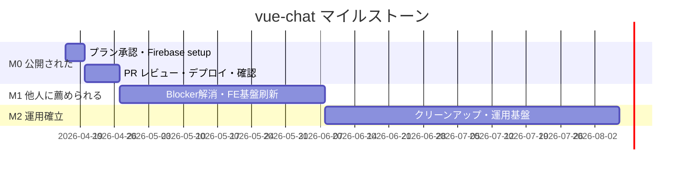

# vue-chat プロジェクト全体ロードマップ

最終更新: 2026-04-16
出典プラン: `~/.claude/plans/cheerful-herding-pike.md`

---

## 1. マイルストーン全体像

```
2026
   4/16        4/26                6/21                  ?
    │           │                   │                    │
    ▼           ▼                   ▼                    ▼
 [今日]──W1──[M0完了]──5週間──[M1完了]──未確定──[M2完了]
            「公開された」    「他人に薦められる」  「運用確立・撤退自由」

  M0 (2週間):
    *.web.app で第三者がアクセスでき
    自分のアカウントで主要導線が動く

  M1 (約6週間):
    Blocker B1/B2/B4/B5 全解消
    FE基盤刷新 (FSD/Pinia/<script setup>/CSS tokens)
    Rules本番マルチユーザー検証

  M2 (期間未確定):
    旧コード/データ最終削除
    運用手順書最終化、cron監視
    利用規約・プライバシーポリシー
    Sentry/CI/CD導入
```

### Mermaid 形式（GitHub 等で render 可）



---

## 2. M0 の Issue 構成と依存

```
[#63 振り返り docs]          (PR #66 既に open)
        │
        ▼
[#64 デプロイ準備 docs]
        │
[NEW-a firebase.json + .firebaserc]  ← M0 真の Blocker (B3)
        │
        ▼
[#65 初回デプロイ + 動作確認]
        │
        ▼
   M0 完了 (4/26)
```

---

## 3. M1 の Issue 構成（並列実行可能）

```
M0 完了
   │
   ▼
┌────────────────────────────────────────┐
│  M1 並列レーン (互いに独立)             │
├────────────────────────────────────────┤
│  NEW-b1: messages 廃止 (B1 解消)       │
│  NEW-b2: ImageUploader 改善 (B2 解消)  │
│  NEW-b3: Header signOut UX (B4 解消)   │
│  NEW-b4: FSD移行+Pinia導入 (B5 解消)   │ ← 大きい
│  NEW-b5: CSS デザイントークン           │
└────────────────────────────────────────┘
   │
   ▼
Rules 本番マルチユーザー検証
   │
   ▼
M1 完了 (約 6 週間後)

独立 Issue:
  NEW-c1: main ブランチ保護ルール（ohikouta 設定作業）
```

---

## 4. エージェント設計パターン

採用: **Orchestrator-Workers + Parallelization (Sectioning) + Evaluator-Optimizer**

出典: Anthropic 公式 "Building effective agents"
https://www.anthropic.com/engineering/building-effective-agents

```
              [Orchestrator (メインセッション)]
                       │
        ┌──────────────┼──────────────┬─────────────┐
        ▼              ▼              ▼             ▼
   [Explore]      [Plan]      [Implementers]  [Evaluator]
   subagent_type  subagent_type  ×複数並列    subagent_type
   = "Explore"    = "Plan"     general-purpose = "Explore"
                              + worktree isolation
                                    │
                                    │
                            ┌───────┴───────┐
                            ▼               ▼
                          PASS           REJECT (max 2 retry)
                            │               │
                            ▼               └→ Implementer 再実行
                       Orchestrator                │
                       PR確認・通知               2連続REJECT
                                                   ▼
                                          AskUserQuestion
                                          (ohikouta判断)
```

---

## 5. ohikouta vs Claude の役割分担

```
┌─────────────────────────────────────────────────────────┐
│ Claude 自律判断 (ohikouta 確認不要)                      │
├─────────────────────────────────────────────────────────┤
│ - コードスタイル・命名・内部実装                          │
│ - 単体ファイル内部リファクタリング                        │
│ - テストコード追加                                       │
│ - docs 文章表現・構成                                    │
│ - ライブラリ minor/patch 更新                            │
│ - FSD/Pinia 内部実装の細部                               │
│ - Issue/PR/Slack のテンプレート                          │
└─────────────────────────────────────────────────────────┘

┌─────────────────────────────────────────────────────────┐
│ グレーゾーン (Claude が選択肢提示 → ohikouta が短時間判断) │
├─────────────────────────────────────────────────────────┤
│ - 設計判断で複数選択肢があるもの                          │
│ - パフォーマンス最適化方針                                │
│ - エラーハンドリング粒度                                  │
│ - ユーザー向け文言                                       │
└─────────────────────────────────────────────────────────┘

┌─────────────────────────────────────────────────────────┐
│ ohikouta 判断必須 (Claude は勝手に進めない)              │
├─────────────────────────────────────────────────────────┤
│ - マイルストーン区切り・完了条件変更                      │
│ - スコープ追加・削減                                     │
│ - ライブラリ major 更新                                  │
│ - Firebase Console 操作 (権限上)                         │
│ - main ブランチ保護ルール                                │
│ - 外部 SaaS 導入 (Sentry/Algolia 等)                     │
│ - データモデル変更・Security Rules 変更                  │
│ - PR の merge 実行                                       │
│ - 期限変更                                               │
└─────────────────────────────────────────────────────────┘
```

---

## 6. 週次稼働モデル

```
ohikouta の稼働: 進捗作業 3h/週 + 進行報告 0.5h/週 = 合計 3.5h/週
同期作業可能時間帯: 平日 10:00-19:00 以外（早朝・夜・週末）

┌──────────────────────────────────────────────┐
│ 通常週 (3h)                                   │
│   PR レビュー + 方針決定 + 必要なら          │
│   Firebase Console 操作 を組み合わせ         │
├──────────────────────────────────────────────┤
│ 報告枠 (0.5h)                                │
│   Claude からの進捗状況報告を受ける           │
└──────────────────────────────────────────────┘

X 型 (ゼロ週):
  ohikouta が「今週ゼロ」と Slack 宣言。
  X が 2 連続 → cron エージェントが re-plan 提案を投下
```

---

## 7. M0 の週次タスク詳細

```
W1 (4/16-4/19) 今週残り
  ohikouta:
    プラン承認 (15min)
    Firebase Console: prd project 作成 (30min)
    Firebase Console: dev project 作成 (30min)
    OAuth Google 登録 (20min)
    OAuth GitHub 登録 (20min)
    authorized domains 設定 (10min)
    firebase login + CLI 初期化 (15min)
    報告 (20min)
    = 計 160min
  Claude:
    Issue 起票完了
    .env.sample PR
    Firebase 連携 docs

W2 (4/20-4/26)
  ohikouta:
    NEW-a PR レビュー (30min)
    #63 docs PR レビュー (20min)
    #64 docs PR レビュー (20min)
    firebase deploy 実行 (15min)
    公開 URL 主要導線確認 (45min)
    Rules 本番マルチユーザー検証 (30min)
    #65 close + Slack 報告 (15min)
    報告 (15min)
    = 計 190min
  Claude:
    NEW-a PR
    デプロイ手順書
    動作確認結果 docs

→ M0 完了 (2026-04-26)
```

---

## 8. 計画放置防止の自動化

```
cron エージェント (毎週月曜 10:00 JST、/schedule skill)
   │
   ▼
1. Calendar の今週イベントと GitHub Issue/PR 状態を突き合わせ
2. 期限超過 Issue を検出
3. ohikouta の前週コミット数・PR レビュー数を集計
4. X 型 2 連続検出 → 再計画提案を Slack へ
   │
   ▼
Slack #prj-vue-chat に <@U08RPS2BLUD> メンション付き投稿
   │
   ▼
期限超過 7 日以上 → 「再スケジュール議論」を要求

(cron 実装は M0 完了後の Issue 化、それまでは Claude が毎セッション冒頭で宣言で代替)
```

---

## 9. 確定事項サマリー

| 論点 | 確定 |
|---|---|
| バックエンド | Firebase 継続（Spark 無料枠） |
| 予算 | 0 円。受けが良ければ有料化を再検討 |
| Firebase 構成 | dev / prd の 2 プロジェクト |
| 公開ドメイン | Firebase デフォルト URL (`*.web.app`) |
| Cloud Functions | 不使用（有料）。client-side trans で代替 |
| 検索 (M1) | Algolia 無料枠を第一候補 |
| エラー監視 (M2) | Sentry 無料枠 |
| CI/CD (M2) | GitHub Actions |
| バックアップ | 手動 GCS export 手順書のみ |
| FE 分類軸 | Feature-Sliced Design (M1 移行) |
| FE State 管理 | Pinia (M1 導入) |
| Vue API スタイル | 新規 `<script setup>`、既存は M2 移行 |
| Style 方針 | scoped CSS + デザイントークン (M1) |
| PR 戦略 | 全 PR を ohikouta レビュー（自動 merge 廃止） |
